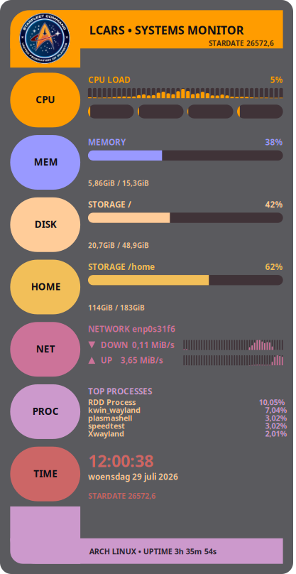

# LCARS-Conky

A scalable Star Trek LCARS-style system monitor for [Conky](https://github.com/brndnmtthws/conky), built in Lua and Cairo. Full system overview — CPU, memory, storage, network, top processes and a clock — drawn as an LCARS console panel on your desktop.



## Features

- **CPU** — overall load bar plus a per-core meter row
- **Memory** — usage bar with used/total readout
- **Storage** — one panel per mount point (`/`, `/home`, add more as needed)
- **Network** — up/down throughput, auto-detects your default interface
- **Processes** — top 5 by CPU usage
- **Clock** — local time, date, and a cosmetic stardate readout
- Classic LCARS chrome: swept elbow brackets, color-coded sidebar pills, pill-shaped meters
- One `HEIGHT` setting in `conky.conf` resizes the whole panel — width and all internal scaling follow automatically
- No blocking calls in the draw loop: data comes from `conky_parse()` and cheap one-time `/proc` reads at startup

## Requirements

- Conky built with Lua + Cairo support (check with `conky -v`, look for `Lua`)
- Optional: imlib2 support in the same build, if you want the header badge image (`cairo_place_image`) — the widget falls back to a drawn badge automatically if it's missing
- Any Linux desktop; developed on Arch Linux + KDE Plasma (Wayland)

## Install

1. Clone this repo somewhere on your system:

   ```bash
   git clone https://github.com/wim66/lcars-conky.git
   cd lcars-conky
   ```

2. Start it:

   ```bash
   conky -c conky.conf
   ```

   or use the included autostart script (kills any running Conky first):

   ```bash
   ./autostart.sh
   ```

3. To launch it automatically on login, add `autostart.sh` to your desktop environment's autostart / session startup.

## Configuring

Most settings live at the top of **`widget.lua`**:

| Setting | What it does |
| --- | --- |
| `iface` | Network interface for the NET panel — auto-detected from your default route at startup, override here if it guesses wrong |
| `sections` | Which panels appear, and in what order |
| `fs_mount` | Mount point for the primary `DISK` panel |
| `badge_png` / `badge_x` / `badge_y` / `badge_w` / `badge_h` | Header badge image, positioned and sized independently of the title text |

To add another storage panel (e.g. a second drive), add an entry to `sections` and wire it up in `draw_section` using `draw_disk_for("/your/mount")` — see the existing `DISK`/`HOME` panels for the pattern.

**Resizing** is a one-line change in **`conky.conf`**:

```lua
local HEIGHT = 900   -- try 600 for a compact version
```

The width is derived from `HEIGHT` automatically (native aspect ratio 460:900), and `widget.lua` scales the whole drawing to fit whatever window size results — nothing else needs adjusting.

## File structure

```text
lcars-conky/
├── conky.conf       -- window/Conky settings; HEIGHT is the one knob you turn
├── widget.lua       -- layout: header, sidebar, panels, footer
├── lcars.lua        -- drawing primitives (rounded rects, elbows, pills, bars, text)
├── data.lua         -- system data gathering (conky_parse + cheap /proc reads)
├── Starfleet.png    -- header badge image
├── autostart.sh     -- kills any running Conky and relaunches with this config
└── preview.png
```

## Credits

Star Trek and the LCARS design language are the property of Paramount. This is an unofficial, non-commercial fan project made for personal desktop customization — not affiliated with or endorsed by Paramount or CBS.
